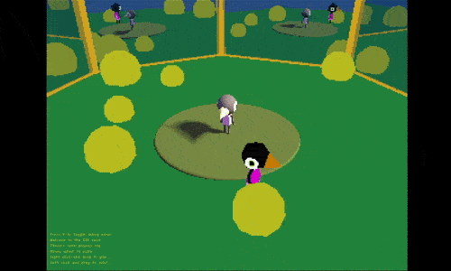

# wasteladns

Experiments on different aspects of interactive 3D applications — mostly for experimentation purposes, they may not be great for reuse (or legibility, even).

## Most recent tests

[SDF Scene Test](c++_2024-/src/TestSDF/README.md) - a small setup blending raymarched SDF pixels with rasterized ones

[Planar Mirror Test](c++_2024-/src/TestMirrors/README.md) - a silly study of recursive mirrored cameras

