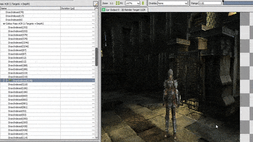

# welcome to the somewhat most recent wasteladns

Workshop to explore different aspects of gamedev. DX and GL on windows, GL on mac.

## Build instructions

Each separate test is conditionally included inside the main project. You can edit `COMPILE_TARGET` inside `src/main.cpp` to alternate between the different tests.

`src/main.cpp` is the only file you need to compile, see instructions below. Please let me know if it doesn't just build out of the box.

### CMake (Windows or MacOS)

CMake should let you configure the build for your environment of choice. 

### Windows command-line 

Alternatively, you can run build.bat on Windows to build the test specified by `COMPILE_TARGET` inside src/main.cpp. You will still require Visual Studio to be installed in your machine:

1. Launch a command-line (say, Windows+R -> cmd.exe)
2. Run `build.bat [dx11|gl33|] [debug|release] [assets|]`. The first parameter determines the graphics API to use (defaults to DirectX11 if empty), the second specifies the build configuration (defaults to debug if empty). The third parameter copies the assets to the build folder (defaults to false, unless the assets folder is missing in the binary directory).
3. If you see the error `'cl' is not recognized as an internal or external command`, it means the Visual Studio installation path wasn't found, and you'll need to provide it yourself. Please find and call `vcvars64.bat` (or `vcvarsall.bat` with the appropriate parameters for your machine) manually before calling `build.bat`. These are usually located in Visual Studio's installation files: `C:\Program Files (x86)\Microsoft Visual Studio\{Year}\{Edition}\VC\Auxiliary\Build\`.

### MacOS command-line 

You can also run build.sh on MacOS to build the test specified by `COMPILE_TARGET` inside src/main.cpp. You will need clang (which should have been installed along with Xcode if you have that, otherwise you can install clang separately through `xcode-select -install`)

1. Launch the terminal (say, Command+Space -> Terminal)
2. Run `sh build.sh [debug|release] [assets|]`. The first parameter determines the build configuration (defaults to debug if empty). The second parameter copies the assets to the build folder (defaults to false, unless the assets folder is missing in the binary directory).

## Current tests

[SDF Scene Test](src/TestSDF/README.md) - a small setup blending raymarched SDF pixels with rasterized ones

[Planar Mirror Test](src/TestMirrors/README.md) - a silly study of recursive mirrored cameras

[Shadow casting technique retrospective](src/TestShadows/README.md) - a research project on how different games have implemented shadows over the years

