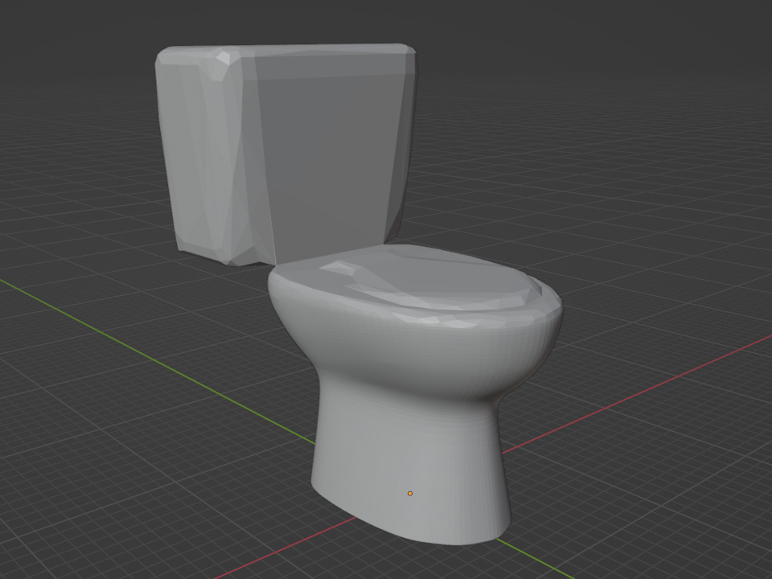
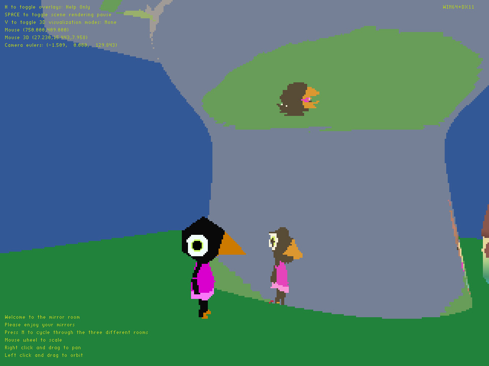
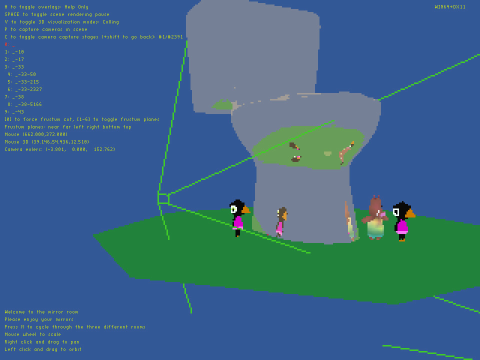
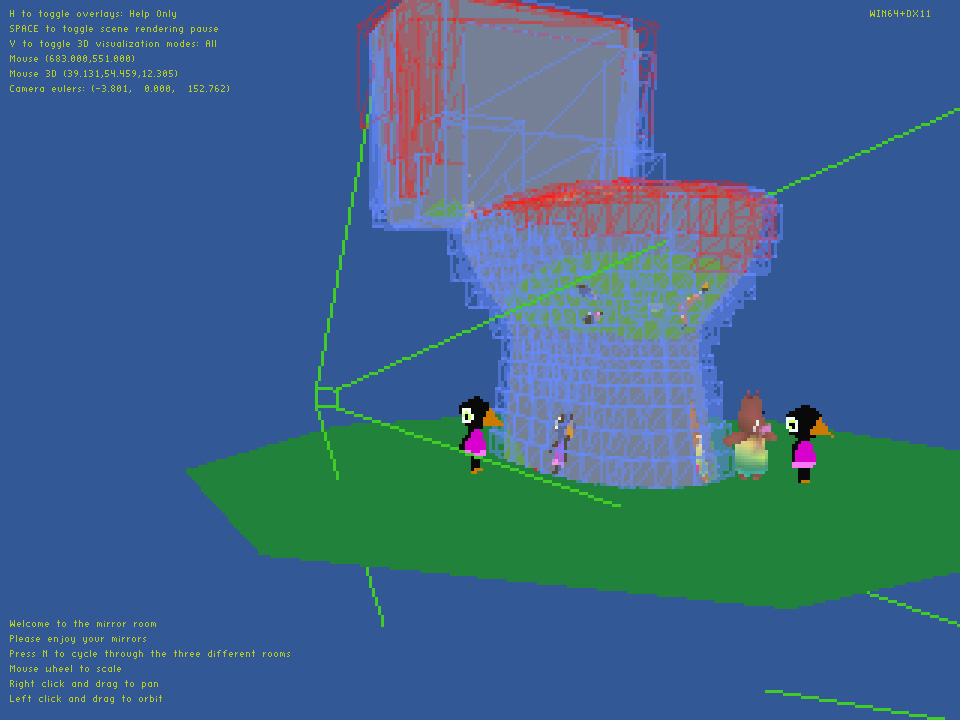
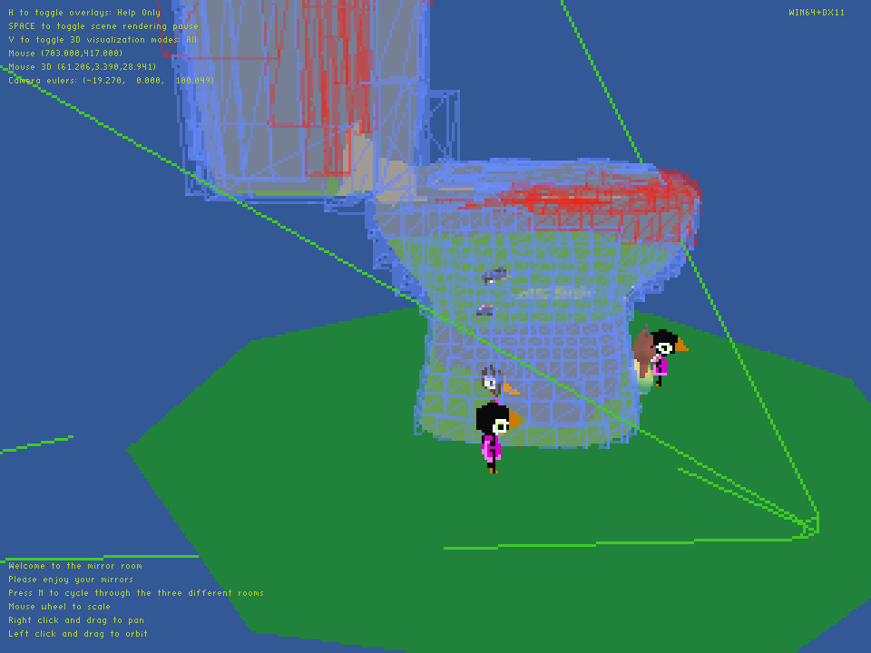
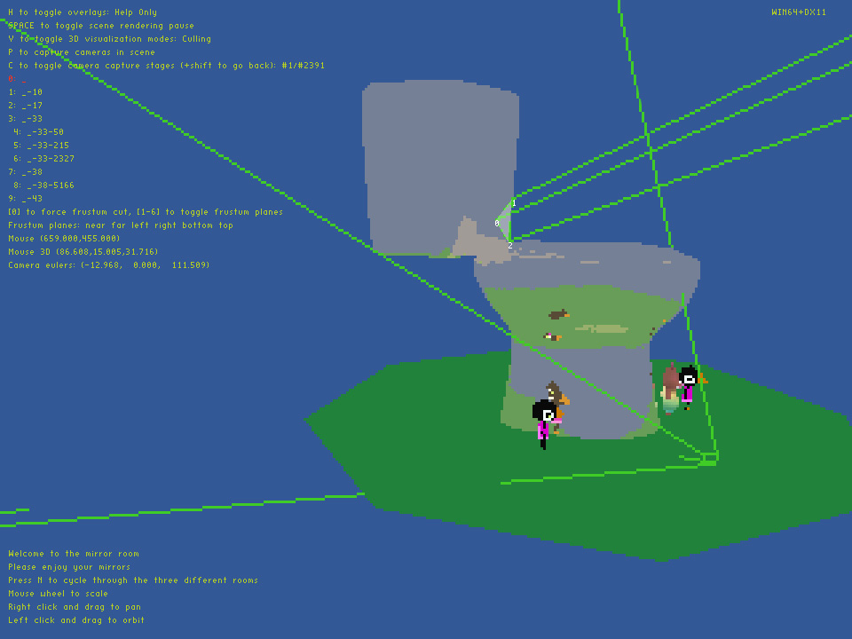
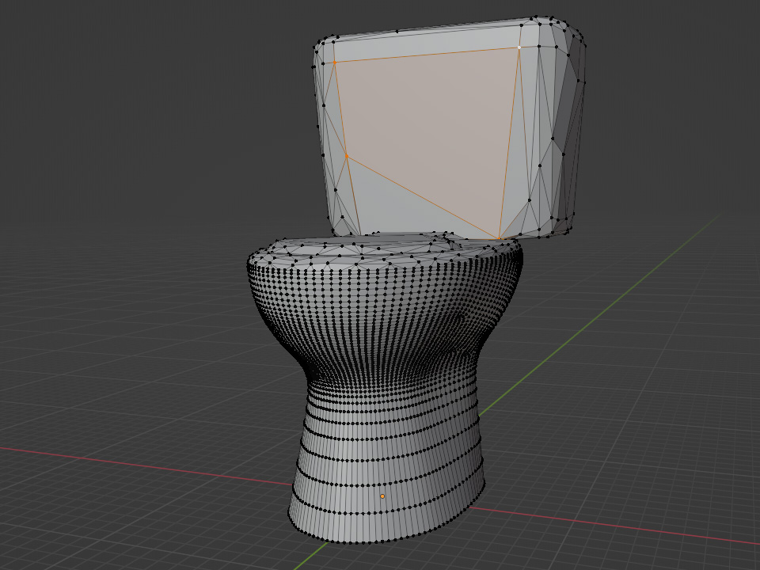
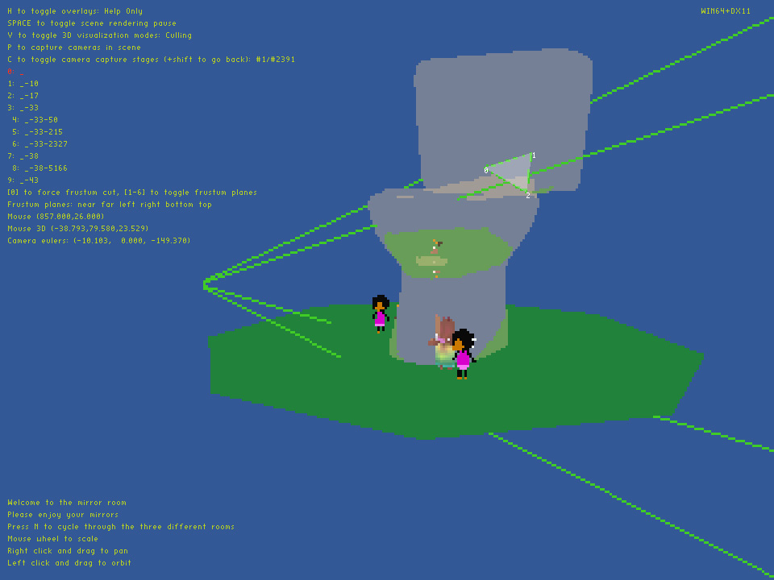
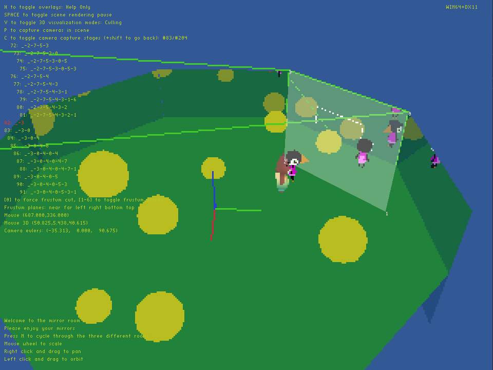
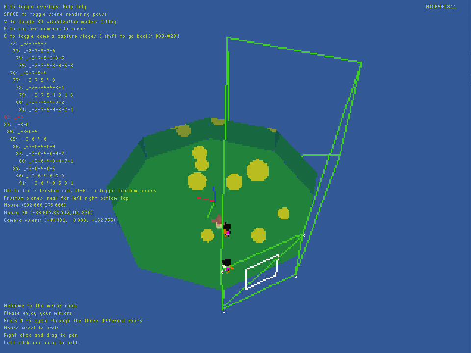

# Planar mirror test

Here is some ugly and dirty code to render a scene with several mirrors, resulting in a number of recursively reflected cameras. Each camera is rendered with the traditional rasterized pipeline, there's no raytracing going on whatsoever. The aim of the test is to see how many mirrored cameras can be handled in one scene.

If you use vim, you can load the .vimrc in this project to set up commands for building and running the project via \<leader>bb and \<leader>rr, respectively.

For building this project, refer to [this very rough blurb](../../README.md). COMPILE_TARGET should be set to TEST_MIRRORS.

Mirrors can be loaded from 3D models, for example:

This mesh contains 10,792 triangles. Some of them are coplanar and adjacent to each other, which means we can combine them together, leaving us with 6,517 polygons to act as mirrors in our scene.

The camera here needs to figure which of the 6k mirrors produce an actual reflection, and for each of those, check again which of the 6k mirrors produce a reflection, and so on. Even if we ignore obvious cases like back facing mirrors and self-reflection, as well as reduce the recursion depth to 3 bounces, this resulting amount of reflected cameras is pretty unreasonable to handle.

 To reduce the number of recursive mirrors to check, a BVH structure around the mirror source model roughly checks which polygons are within the current camera frustrum. The query is implemented via AVX2 intrinsics, which can be disabled with the macro DISABLE_INTRINSICS for a non-SIMD implementation.

This BVH pruning cuts 13 million mirrors from the recursion. It is simply a bounding box check, which makes it fairly easy to process, but it also leaves some false positives. For each mirror polygon that passes the BVH test, we need to actually ensure it lies within the frustum, and recurse using the reflected camera as the new frustum. This clipping algorithm, also implemented with AVX2 (which can also be disabled via DISABLE_INTRINSICS), gets rid of another 6k mirrors.

The reflected camera frustum doesn't have to cover the whole mirror polygon, though. In this particular case, it's easy to see who the active camera only sees part of the 4-vertex mirror.

The polygon clipping algorithm mentioned above returns the actual vertices to use for the reflection, which the new frustum can be built on top of. The final camera count in this example is 2391.

 Note that the near plane of the view frustum for a mirrored camera needs to match the reflection plane, and as such may not be parallel to the far plane in the reflection. The process itself is not too complicated (Eric Lengyel's oblique view frustum work is very nicely detailed), but it requires a slightly more focused logic to compute the frustum vertices for visualization (see renderer::im::frustum).
 

