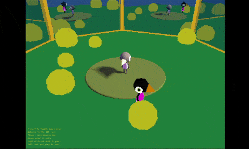
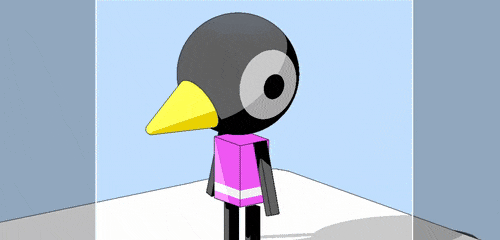
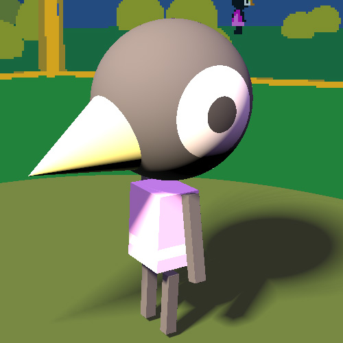
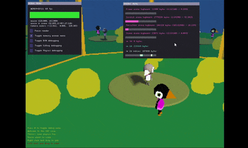

# SDF test

Here is some quick and simple setup to blend a raymarched SDF (signed distance fields) scene with a traditional rasterized one. The techniques are heavily inspired by Iñigo Quilez's articles on the subject.

## Build instructions

### Code

If you use vim, you can load the .vimrc in this project to set up commands for building and running the project via \<leader>bb and \<leader>rr, respectively.

For building code for this project, refer to [this very rough blurb](../../README.md). COMPILE_TARGET should be set to TEST_SDF.

### Shaders (Window's only, for now)

If you edit shaders, whether on DirectX or OpenGL, you'll need to rebuild them so they can be loaded as string literals in the C++ project:

1. Launch a command-line (say, Windows+R -> cmd.exe)
2. Call either `vcvars64.bat` or `vcvarsall.bat`. These are usually located in Visual Studio's installation files: `C:\Program Files\Microsoft Visual Studio\{Year}\{Edition}\VC\Auxiliary\Build\`
3. Run `shader_build.bat [dx11|gl33|]` to build all shaders, or `shader_build.bat file` to build a specific shader file. If no graphics API is specified, all shaders are compiled. Note that you don't need to specify the graphics API when compiling a single file, as it is auto-detected.

If you are on Visual Studio, you can set up an External Tool to compile shaders in this project using the bat file. It's not perfect, but it's ok for now:
1. Open the `Tools->External Tools` dialog
2. Create a new tool called `Compile Shader`, with a command `%systemroot%\system32\cmd.exe` and arguments `/k call "C:\Program Files\Microsoft Visual Studio\{Year}\{Edition}\VC\Auxiliary\Build\vcvars64.bat" && call "$(SolutionDir)src\TestSDF\shader_build.bat" "$(ItemPath)"`, where `{Year}` and `{Edition}` are specific to your setup.
3. Alternatively, you can set up a tool to compile all shaders by using the arguments `/k call "C:\Program Files\Microsoft Visual Studio\{Year}\{Edition}\VC\Auxiliary\Build\vcvars64.bat" && call "$(SolutionDir)src\TestSDF\shader_build.bat"`
You can then set up a shortcut under `Tools->Options->Environment->Keyboard` and selecting the appropriate `Tools.ExternalCommand{number}` from the list.

## Breakdown

The SDF scene is roughly based on a very quick mock-up done in Adobe Neo:

The head is a simple sphere, as are the eyes, which project their material onto the head. The beak is constructed using a cone, and the body uses two boxes, one for the main color and shape, and one for the projected material around the belt. The limbs are also box shapes.

The mirrors use the same setup as [the one detailed in this test](../TestMirrors/README.md), and don't really add much to the scene, since it's not reasonable to render the SDF scene with as many passes as a recursive mirror scene demands. 
The SDF scene could handle its own reflections, but it wouldn't have a way to blend the depth with the rasterized scene, since we lose the depth of every reflection after each mirror pass. Regardless, the mirror scene is there and the SDF scene does render on each mirror pass, however it is at least culled using the camera's frustum.

This test also uses a new zero-memory immediate mode UI, based on Casey Muratori's and Sean Barrett's work. Feel free to look at `im::WindowContext` and related code inside `helpers/immediate_mode.h`.

