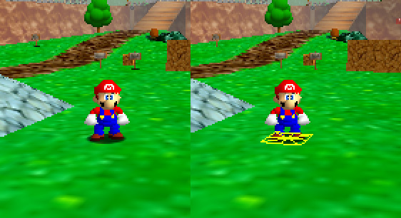
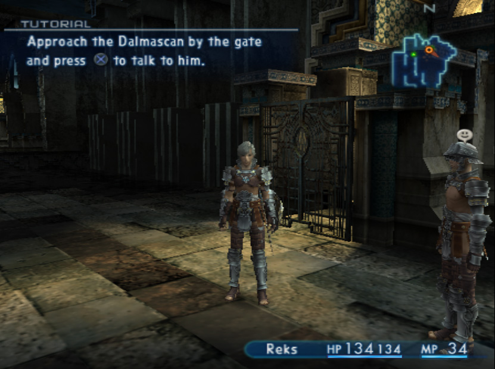

# Shadow casting technique retrospective

I thought it would be interesting to investigate how different games throughout the years have implemented different shadow casting effects.

Much of this research has been done on emulated or ported titles, meaning the nitty gritty of texture formats, type of draw calls and other specifics I have found may not be all that relevant. I'll try not get into them.

This is all still very much a work in progress.

## Mario 64 (Nintendo 64)

Cast shadows are achieved by drawing quads with a textured black circle and some alpha. The quad is positioned at the ground position below the entity, and its vertices are aligned to the floor’s normal.

Note that some entities use a square texture instead, but the process is the same:

The N64 had a depth test, so the quad gets clipped accordingly if there’s a wall, or an incline, or any geometry closer to the camera than the quad:

As you would expect, static entities inside each level don’t generate their shadow quads in real-time, instead they are loaded as part of the level:

Some of the more complex level shadows are baked into the vertex colors of the level model itself, and do not use shadow textures.

I don't have a good way of showing this via RenderDoc (the PC port handles the color combining on the CPU, so the source vertex colors are not accessible on the GPU side), so here's a rough view of the same level using SM64Paint (vertices under the bridge are colored with darker gray):

These vertex colors end up multiplying the sampled texture, giving it a shaded look. The specifics of how they are combined with the the light, camera, alpha and many other details are covered here:
https://ultra64.ca/files/documentation/online-manuals/man/pro-man/start/index.html
https://www.youtube.com/watch?v=YJJC6FJKu58

Speaking of complexity, Mario’s shadow quad has 9 vertices, not just 4:

The game checks whether each of these vertices are also on the ground and, if not, sets their alpha to 0, making the texture fade out. Having 9 vertices probably helps with the granularity of this effect:

There’s some alternate code-path, disabled in the final version in the game, that pushes each one of these 9 vertices vertically to the ground. The idea is that the shadow polygon would adjust to the floor around Mario. In practice, however, 9 vertices adjusted vertically are really not enough to correctly adapt to any surface, and it can easily look odd:

You can check out the details in the decompiled source code, along some more nuance about opacity and placement of shadows on different surfaces:
https://github.com/n64decomp/sm64/blob/9921382a68bb0c865e5e45eb594d9c64db59b1af/src/game/shadow.c#L359

## Final Fantasy XII (PS2)

Immediatelly we can see that there are two types of cast shadows. First, there's the level geometry, which seems to be baked into the vertex colors:

These shadows seem to sometimes affect the player's shading, making them darker as a whole as they enter the shaded area. I suspect this is done globally per actor (as opposed to actually projecting any shadows), maybe by tinting to the vertex colors when the actor is currently on top of a collision triangle that's tagged as shaded. But that's just speculation.

Characters also cast shadows, and these ones — shaped like discs — are computed in real time underneath them. If you squint a bit, you'll see that the soft shadow effect is just a combination of concentric circles at different opacities:

This is done through stencil shadows, or basic shadow volumes — I enjoyed Eric Lengyel's explanation of these in Foundations of Game Engine Development Rendering book, but the info about them is out there. Technically Final Fantasy XII uses the alpha channel as the mask instead of the stencil (I'm unsure whether this is because of PS2's hardware limitations with relation to the stencil, or a matter of the emulator I'm using), which involves a tiny bit of GPU gymnastics:

Step 1: draw the front faces of the shadow volume cylinder, top cap on, and clip anything that’s behind the level geometry. For any succeeding triangles, increase the alpha channel by 1.

Step 2: draw the back faces of the same shadow volume cylinder, this time with the bottom cap on, clipping anything that’s behind the level geometry. For any succeeding triangles, decrease the alpha by 1. The alpha channel will now be 1 at the intersection pixels between the shadow volume cylinder and the level geometry.

Step 3: draw the same shadow volume cylinder again, front faces, and clip anything behind the level geometry. On the succeeding triangles, draw a black tint to the existing color buffer using the existing alpha value for that pixel (which we have previously set up to be the intersection of the volume and the level). Again, we don’t modifiy the alpha channel in this step, we just read it.

From here on the process is a bit repetitive:

Step n: draw a smaller version of the shadow volume, backfaces only and bottom cap on, clipping what’s behind the level. The passing triangles will decrease the alpha by 1, meaning our cross section of the shadow in the alpha channel will get smaller.

Step n+1: draw the same smaller version of the shadow volume, front faces and top cap, clip what’s behind the level. For the passing triangles, draw a black tint using the alpha set in the previous step. Note that the alpha channel keeps reducing the shadow on the top half of the circle, not the bottom half. This is because our depth test is already clipping our smaller cylinder, so the bottom half of the circle will already be smaller.

These last two steps are repeated several times, until the amount of concentric circles gives the shadow edge a smooth look.